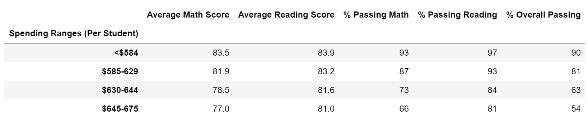
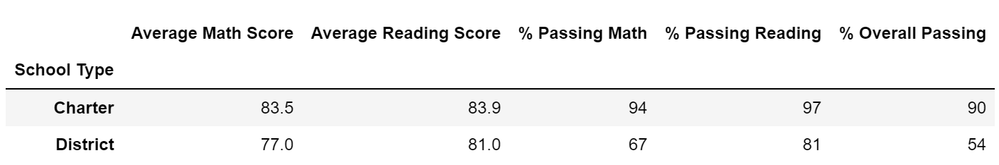

# School District Analysis (using Pandas) - PyCitySchools
---
## Overview of Project
In this week's module, we've been tasked to assist a data scientist working for a city school system.
Pulling from different resources, we are prepping standardized tests data for analysis, reporting, and presentation.
The object is to provide insight on performance trends and patterns. 
By analyzing data at school and district levels, it helps the school board have informed discussions and make strategic decisions
related to budget and other priorities. With the aggregated data, we are looking at school performance across different metrics: 

- District Performance Summary
- School Performance Summary
- High/Low School Performers based on overall passing rate
- Average Math scores for each grade level at each school
- Average Reading scores for each grade level at each school

### Purpose
In the challenge, the school board had notified evidence of academic dishonesty at a specific school (Thomas High School (THS)). 
Apparently, the math and reading scores for all ninth graders were altered. As such, the purpose of the analysis is to scrub
the incorrect data and replace them with no values. In addition, after the scores have been replaced, it's necessary to note
the impact (if any) to the data.  

## Analysis/Results
---

### The Ask
In the deliverable, a code was already partially written in Jupyter Notebook & the task was to complete the code
so it could generate the desired metrics noted above.

Within the code, we imported `pandas` in order to manipulate our data and data structures.
Some instances included: reading the csv file, merging tables, binning and creating data frames throughout the code.
In addition, we brought in `numpy` for the purpose of changing the 9th grade scores at THS to no values.
Also, before running through the code, there was additional work to clean up the data prior, like cleaning out any undesired prefixes/suffixes.
With the anticipation of the school board coming back to ask for the analysis of a different school, I added additional code to index for the high school so that throughout the code, I no longer have to hardcode for THS, but rather it references the "desired_high_school" value.
Furthermore, by walking step by step through the ask, the requested values generated appear in the results section.

### Results
*1. How is the district summary affected?*
>BEFORE the ninth grade data was removed

AFTER the ninth grade data was removed

After removing the 9th grade math and reading scores from THS, we can see there was a marginal difference to the entire district.
The "Average Math Score" slightly dropped by 0.1 while the "Average Reading Score" didn't change. 
In addition, the passing percentages for both math and reading dropped by 1.1% while the "% Overall Passing" dropped by 1%.
Nevertheless, by removing the incorrect data for THS, the change/impact was minimal.

*2. How is the school summary affected?* 
While the change wasn't drastic within the district, the analysis looks further into the data and looks at the updated information from a school level perspective.
>BEFORE - accounts for ninth graders within the dataset

AFTER - doesn't account for ninth graders within the dataset

While the reading and math scores were removed for 9th graders at THS, they were still being accounted
in the denominator to calculate for the passing rates. As a result, the denominator was modified to only included students 
between 10th and 12th grade. With this update, we can see that the numbers for Thomas High School has changed drastically in relation to only percentages.  
* Notice how the passing math percentage jumps from *66.9%* to *93.2%*; that's about a 26.3% increase. 
* In addition, the passing reading percentage goes from *66.7%* to *97.0%*; which is about a 30.3% increase. 
* Overall, we see the passing percentage at THS go from *65.1%* to *90.6%*; marking a 25.5% increase.

The rest of the data for the other schools remain unchanged.

*3. How does replacing the ninth graders’ math and reading scores affect Thomas High School’s performance relative to the other schools?* 
Interestingly, when you order the "% Overall Passing" in descending order, you will notice that Thomas High School's performance 
has increasingly improved! In a district of 15 different schools, THS was ranked 8th in overall performance. When the data no longer accounts
for the 9th graders in the denominator, we see THS move into the Top 2 in overall performance.

>8th Position

>2nd Position

*4. How does replacing the ninth-grade scores affect the following:* 

*4a. Math and reading scores by grade* 
After replacing the ninth-grades scores, there was no relative change to the other scores in the dataframe. 
Within the dataframe you see that 9th graders at Thomas High School are null. 

*4b. Scores by school spending* 
In comparing the original analysis to the following updated analysis, 
there was no change to the spending bins.

In the spending bins, we're cutting by the per_school_capita,
which references the total students and total school budget. In the removal of the 9th graders' scores, it
doesn't remove them from the data. They are still students that need to be accounted for in the spending budget.

*4c. Scores by school size* 
Again, the following dataframe showed no change to the data, even after replacing the ninth-grade scores.

*4d. Scores by school type* 
The dataframe reflecting school types also showed no changes in comparison to the original dataframe.

**OBSERVATION:** 
In the original analysis (in the module) - the following reflects the data for THS:

After scrubbing out the 9th graders (in the challenge) - the following reflects the data for THS:

As you can see, the changes in Average Math Scores, Average Reading Scores, % of Passing Math,
% of Passing Reading, % of Overall Passing (the last five values in respective order) 
barely changed by a tenth. As such, no matter how you cut the data and average these values,
the variance is minimal. In addition, the way the data is formatted in the final output, and only
reflecting up to the tenth digit, it's difficult to see that variance change. Resultantly, 
the data is assumed to have no change.

## Summary
---
*Summarize four major changes in the updated school district analysis after reading and 
math scores for the ninth grade at Thomas High School have been replaced with NaNs.*

* The first immediate change that jumped out to me after removing the math and reading scores for the 9th graders 
was the increase of percentages in the school summary. It was very noticeable that Thomas High School went from percentages in the 60s to the 90s. As such, the overall passing percentage showed an approximate 25.5% increase.  
* Next, in relation to the percentage changing, the next major change in the updated analysis was Thomas High School's
postion in school performing ranks. Jumping from the 8th spot to the 2nd spot is definitely worth noting.
* As part of the challenge, we needed to update the math and reading scores for THS. I think it is also important to note that when this change occurred in the `student_data_df`, it also changed the `school_data_complete_df` dataset. Not only did NaN reflect in the `student_data_df`, it updated in the complete dataset as a result of the merge. Thereafter, the `school_data_complete_df` was referenced throughout the remaining part of the code.  
* Moreover, the result of the percentage changes traces back to removing the 9th graders out of the denominator.
As a front-end customer looking at the analysis, it's hard to see that change because it's not really highlighted.
However, it is an important change from the back-end perspective. In Step 5 of the challenge, it was requested to
only retrieve the number of 10th-12th graders to use as a new student count within the data. At this point, the student count at Thomas High School went from 1,635 to only 1,174 students. Resultanltly, the 1,174 students were
used to calculate the new passing percentages.

Rightfully, the school board was concerned about the integrity of the data with the new information of academic dishonesty. After modifying and iterating through the data, it's safe to say, the overall impact was very minimal.
With or without Thomas High School's ninth grade scores, the district numbers did not deviate much from the original. However, it is clear that Thomas High School did benefit from the changes. Moreover, with the updated
data, I'm confident the school board can move forward knowing the data is accurate and consistent.
